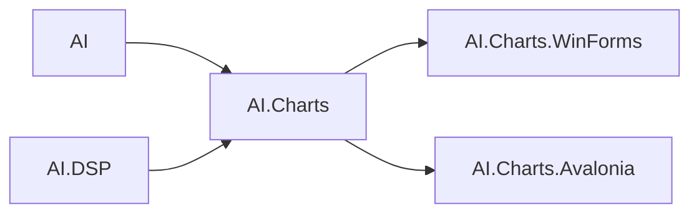

# Графики: `AI.Charts`, WinForms, Avalonia

Модуль визуализации данных на **SkiaSharp**: кроссплатформенное ядро без привязки к UI и отдельные хосты для **Windows Forms** и **Avalonia**.

| Сборка | TFM | Роль |
|--------|-----|------|
| **`AI.Charts`** | **net9.0** | **`ChartView`**, элементы серий (`Plot`, `Bar`, `Scatter`, `Area`, полярные и круговые варианты), отрисовка в `SKCanvas`, растр `ToBitmap`. Зависимости: **`AI`**, **`AI.DSP`**. |
| **`AI.Charts.WinForms`** | net9.0-windows | **`ChartVisual`**, **`HeatMapControl`**, **`FormChart`**, пространство имён элементов **`AI.Charts.WinForms`**. |
| **`AI.Charts.Avalonia`** | по проекту | **`ChartViewControl`**: свойство **`Chart`** типа **`ChartView`**, вывод через PNG/битмап в Avalonia. |

В **`AI.Charts`** для сборок WinForms/Avalonia объявлено **`InternalsVisibleTo`**, чтобы общая отрисовка и вспомогательные типы оставались в одном месте.

---

## Структура ядра (`AI.Charts`)

| Компонент | Описание |
|-----------|----------|
| **`ChartView`** | Список серий (`IChartElement`), масштабы осей, подписи, **`VisualData(ChartData)`**, экспорт в bitmap. |
| **`Rendering.ChartViewport`** | Область построения `PlotRect`, преобразования данных <-> пиксели, полярные/круговые параметры. |
| **`Rendering.SkiaChartFrame`** | Сетка, оси, заголовок; **`LayoutCartesianMargins`** — динамические поля под подписи; **`DrawCartesianLegend`** — легенда с подложкой **после** серий. |
| **`Rendering.ChartSeriesPalette`** | Цвета по умолчанию для серий без явного цвета. |
| **`ChartElements.*`** | Конкретные серии: `Plot`, `Bar`, `ScatterPlot`, `Area`, `RadialPlot`, `Circul` и т.д. |

Зависимость от **`AI.DSP`** используется для спектров, окон и вспомогательной обработки в сценариях графиков (см. вызовы в `ChartView` и связанных типах).

---

## Зависимости (фрагмент)



---

## Учебные материалы

- Практический разбор API: **[../Tutorials/Charts/README.md](../Tutorials/Charts/README.md)** и **[../Tutorials/Charts/ChartViewAndControls.md](../Tutorials/Charts/ChartViewAndControls.md)**.

```bash
dotnet build src/AI.Charts/AI.Charts.csproj -c Release
dotnet build src/AI.Charts.WinForms/AI.Charts.WinForms.csproj -c Release
```
