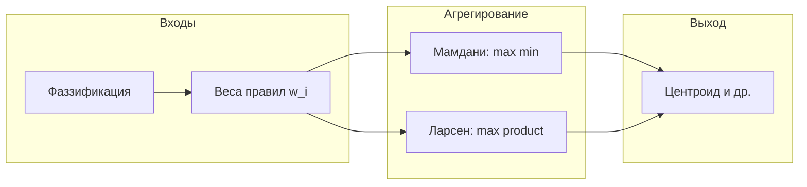

# Нечёткая логика в AIFramework 3.0 Open

Сборка **`AI.Fuzzy`** (`AI.Fuzzy.dll`, **.NET 9.0**) содержит типы для нечётких множеств, импликаций, типовых методов нечёткого вывода (Мамдани, Ларсен, Сугено, Цукамото), нечёткого регулятора в духе PID, а также гибридные ML-компоненты (`FuzzyClassifier`, `LingVarGaussian`). **Зависимости по `ProjectReference`:** **`AI`** (векторы и матрицы из `AI.DataStructs.Algebraic`), **`AI.ML`** (базовые классификаторы и т.д.), **`AI.KNN`** (для `LingVarGaussian` и связанных сценариев).

Обобщённые структуры нечётких множеств для логики и вероятностных рассуждений — в пространстве имён **`AI.Fuzzy.Sets`** (те же типы физически в каталоге `src/AI.Fuzzy/Sets/`).

---

## Структура пространств имён

| Пространство имён | Назначение |
|-------------------|------------|
| `AI.Fuzzy` | Нечёткая логическая переменная (FLV), классические термы, вывод по аналогии, инструменты множеств (каталог `Core/`). |
| `AI.Fuzzy.Sets` | Обобщённые нечёткие множества (`FuzzySet`, генераторы, интерфейсы `IMu`, `IImageSet`) для связки с **`AI.Logic`**. |
| `AI.Fuzzy.Inference` | Мамдани, Ларсен, Сугено, Цукамото, треугольные/трапециевидные формы. |
| `AI.Fuzzy.Control` | Нечёткий «PID»-регулятор (`FuzzyPIDController`). |
| `AI.Fuzzy.Fuzzification` | Фаззификация: `LingVarGaussian`, векторные фаззификаторы (`IFuzzyficatorVector`, `SigmoidVectorFuzzyficator`). |
| `AI.ML.Classification` | `FuzzyClassifier` (наследник `BaseClassifier` из **`AI.ML`**). |

Текстовые средства (стеммер, BoW, TF‑IDF и т.п.) вынесены в **`AI.NLP`** — обзор [NLP.md](NLP.md), туториалы [../Tutorials/NLP/README.md](../Tutorials/NLP/README.md). Связка нечёткой логики с ML и kNN реализована в **`AI.Fuzzy`**; при текстовых пайплайнах подключайте **`AI.NLP`** явно.

---

## Базовые типы (`AI.Fuzzy`)

### `FLV`

Нечёткая логическая переменная со значением в **[0, 1]**, операции НЕ, И, ИЛИ, а также **импликации**:

- **Гогена** — `GImplication`;
- **Мамдани** — `MamdaniImplication` (минимум);
- **Ларсена** — статический метод **`LarsenImplication(double, double)`** (произведение степеней истинности).

Файл: `src/AI.Fuzzy/Core/FLV.cs`.

### Классические термы и правила

`ClassicFuzzySet`, `FuzzyVariable`, `FuzzyRuleClassic`, `FuzzyCondition`, `Conclusion` — каркас для описания правил «если — то» с функциями принадлежности. Файл: `src/AI.Fuzzy/Core/ClassicFuzzySet.cs`.

### Вывод по аналогии

Класс **`FuzzyAnalogyInference`** строит матрицы импликаций (Гоген, **Мамдани**, **Ларсен**) и выполняет шаг вывода по матрице и вектору условий. Файл: `src/AI.Fuzzy/Core/FuzzyAnalogyInference.cs`.

Для полного конвейера **агрегирование + дефаззификация** используйте классы из **`AI.Fuzzy.Inference`** (ниже).

### Инструменты множеств

**`FuzzySetTools`** — объединение нечётких множеств, сходство и др. Файл: `src/AI.Fuzzy/Core/FuzzySetTools.cs`.

### Обобщённые нечёткие множества (`AI.Fuzzy.Sets`)

`FuzzySet`, `FuzzySetElement`, `FuzzySetGenerator` и связанные интерфейсы — каталог: `src/AI.Fuzzy/Sets/`.

---

## Методы вывода (`AI.Fuzzy.Inference`)

### Общая схема

На дискретной сетке по выходной переменной задаются отсчёты функций принадлежности следствий правил. У каждого правила есть **вес срабатывания** $w_i \in [0,1]$. Далее строится **агрегированное** нечёткое множество и при необходимости выполняется **дефаззификация** (например **центр тяжести**).



### Мамдани — `FuzzyMamdaniInference`

- Импликация по правилу на сетке: $\min(w_i, \mu_i(u))$.
- Агрегирование по правилам: $\mu_{\mathrm{agg}}(u) = \max_i \min(w_i, \mu_i(u))$.
- **`DefuzzifyCentroid`**, **`InferCentroid`**.

Файл: `src/AI.Fuzzy/Inference/FuzzyMamdaniInference.cs`.

### Ларсен — `FuzzyLarsenInference`

- Импликация: **произведение** $w_i \cdot \mu_i(u)$ (аналогично матрице с элементами `if[i] * then[j]`).
- Агрегирование: $\mu_{\mathrm{agg}}(u) = \max_i (w_i \cdot \mu_i(u))$.
- Дефаззификация — та же **центроидная**, что и после Мамдани.

Файл: `src/AI.Fuzzy/Inference/FuzzyLarsenInference.cs`.

### Сугено (Такаги–Сугено) — `FuzzySugenoInference`

- **Нулевой порядок**: следствия — **синглтоны** $c_i$; результат $z = \sum w_i c_i / \sum w_i$ при **`WeightedAverageSingletons`**.
- **Первый порядок**: $z_i = c + \mathbf{a}^\top \mathbf{x}$, затем взвешенное среднее — **`TakagiSugenoOrder1`**.

Файл: `src/AI.Fuzzy/Inference/FuzzySugenoInference.cs`.

### Цукамото — `FuzzyTsukamotoInference`

Требуется, чтобы функция принадлежности **следствия** на выбранном отрезке была **монотонной**, чтобы существовало обратное отображение $\mu^{-1}(\alpha)$ для степени срабатывания $\alpha$.

- **`InverseMonotoneMembership`** — поиск $z$ бисекцией при заданной монотонности (**возрастание** / **убывание**).
- **`Infer`** — для каждого правила $z_i = \mu_{Ci}^{-1}(\alpha_i)$, затем взвешенное среднее (как у Сугено-0).

Файл: `src/AI.Fuzzy/Inference/FuzzyTsukamotoInference.cs`. Перечисление **`TsukamotoOutputMonotonicity`**.

### Формы принадлежности — `FuzzyMembershipShapes`

**`Triangular`**, **`Trapezoidal`** — для фаззификации и построения термов на сетке. Файл: `src/AI.Fuzzy/Inference/FuzzyMembershipShapes.cs`.

---

## Нечёткий регулятор (`AI.Fuzzy.Control`)

### `FuzzyPIDController`

Три входа: **ошибка** $e = \mathrm{setpoint} - \mathrm{process}$, **производная** ошибки, **интеграл** ошибки. Значения масштабируются в **[-1, 1]** (`Ke`, `Kde`, `Kie`), термы **N / Z / P** (треугольники), **27 правил**, встроенная таблица синглтонов следствий.

- **`Mode`**: **`Sugeno`** или **`Mamdani`** (для Мамдани следствия задаются треугольниками вокруг синглтонов на сетке).
- **`AccumulateOutput`**: накопление выхода как интеграла приращений или прямое значение нечёткого вывода.
- **`PreviewOutput`**, **`ComputeOutputOnly`** — удобно для отладки.

Файл: `src/AI.Fuzzy/Control/FuzzyPIDController.cs`.

---

## Связь с другими сборками

| Сборка | Роль |
|--------|------|
| `AI.ML` | Базовый `BaseClassifier`, используемый **`FuzzyClassifier`**; транзитивно тянется через **`AI.KNN`**. |
| `AI.KNN` | `KNNCl` и связанная логика для **`LingVarGaussian`**. |
| `AI.Logic` | Вероятностные и логические конструкции; для нечётких множеств использует типы из **`AI.Fuzzy.Sets`** (сборка **`AI.Fuzzy`**). |
| `AI.NLP` | Словари вероятностей, стеммер, TF‑IDF, токенизация текста — при необходимости рядом с fuzzy/ML-пайплайнами. |

---

## Консольная проверка

Проект **`Tests/Logic/FuzzyInferenceConsole`** демонстрирует вызовы Мамдани, Ларсена, Сугено, Цукамото и шаги нечёткого PID:

```bash
dotnet run --project Tests/Logic/FuzzyInferenceConsole -c Release
```

---

## Сборка и пакет

```bash
dotnet build src/AI.Fuzzy/AI.Fuzzy.csproj -c Release
```

Метаданные NuGet для библиотек под `src/` задаются в корневом **`Directory.Build.props`** (`PackageId` по имени сборки).

---

## Учебные материалы по методам вывода

Теория, формулы и соответствие типам API: [../Tutorials/Fuzzy/README.md](../Tutorials/Fuzzy/README.md).

---

## Литература и соглашения

В коде и именах сохранены привычные в учебниках обозначения: **Мамдани** (min), **Ларсен** (product), **Сугено** (Takagi–Sugeno), **Цукамото** (обратные монотонные следствия + взвешенное среднее). Конкретные коэффициенты в **`FuzzyPIDController`** — эвристика для старта настройки; под объект заменяйте таблицу следствий или обёртку со своим нечётким выводом.

Лицензия проекта: **Apache 2.0** (см. корень репозитория).
