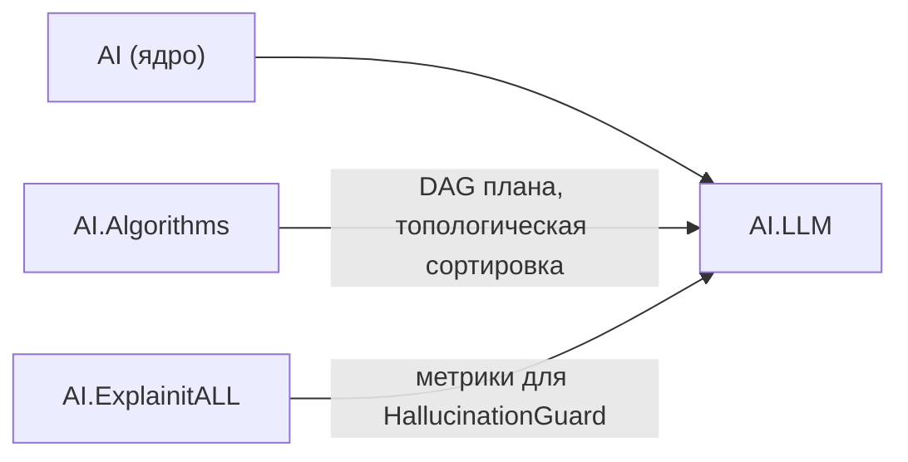
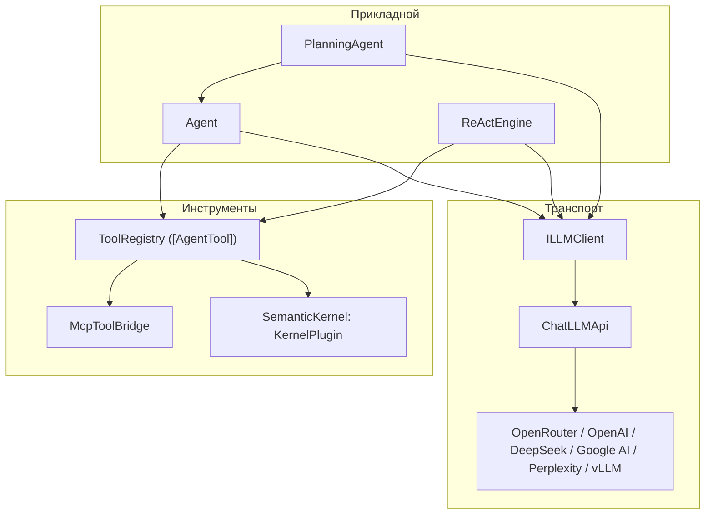

# LLM и агенты (AI.LLM)

Сборка **`AI.LLM`** (`AI.LLM.dll`, **.NET 9.0**) — прикладной слой фреймворка: клиенты языковых моделей, автономные агенты, инструменты, память, проверки ответа и мосты к внешним экосистемам (MCP, Semantic Kernel). Это самая крупная сборка в `src/` и единственная, которая ходит в сеть.

Пакеты NuGet: **Microsoft.SemanticKernel**, **ModelContextProtocol.AspNetCore**, **Serilog**, `System.Text.Json`, `Newtonsoft.Json`. Зависимости от проектов фреймворка: **`AI`**, **`AI.Algorithms`**, **`AI.ExplainitALL`**.

Ключевое правило слоя: **все обращения к модели идут через `ILLMClient`**. На нём держится учёт расходов, настройки reasoning и потоковая выдача, поэтому мосты к SK и собственные агенты не обходят его напрямую — иначе вызовы просто выпадают из статистики.

---

## Пространства имён

| Пространство имён | Назначение |
|-------------------|------------|
| `AI.LLM.Core.Abstractions` | Контракты слоя: `ILLMClient`, `IEmbedderService`, `IRerankerService`, `IStreamHandler`. |
| `AI.LLM.Core.Models.Common` | Общая модель обмена: сообщения и их содержимое, запросы (`GenerateSettings`), ответы (`ChatCompletionsResponse`, `Usage`), вызовы инструментов. |
| `AI.LLM.Core.Models.Providers` | Форматы конкретных поставщиков (OpenRouter, VLLM, Infinity, LocalServer, генерация изображений). |
| `AI.LLM.Clients` | Клиенты поставщиков поверх общей базы `ChatLLMApi`. |
| `AI.LLM.Services.LLM` | Готовые обвязки: `LLMBase`, клиенты под конкретных поставщиков, `ClassifierWithLLM`. |
| `AI.LLM.Services.Embeddings` | Эмбеддеры (Infinity, OpenRouter) и базовый `EmbedderServiceBase`. |
| `AI.LLM.Services.Prompts` | Few-shot (`FewShotManager`) и персональный чат (`PersonaChat`). |
| `AI.LLM.Agents` | Агент `Agent` (Observe-Reason-Act), его сборка и результат, учёт расходов `AgentUsage`. |
| `AI.LLM.Agents.ReAct` | Движок цикла ReAct: политики решений, инструменты, синтез, рендеринг следа. |
| `AI.LLM.Agents.Tools` | Инструменты на атрибутах: `AgentToolAttribute`, `ToolRegistry`. |
| `AI.LLM.Agents.Planning` | Генератор планов: `PlanGenerator`, `PlanTree`, `PlanTier`, `Skill`. |
| `AI.LLM.Agents.Orchestration` | `PlanningAgent`: планирование → выполнение → перепланирование. |
| `AI.LLM.Agents.Memory` | Память диалога: скользящее окно, суммаризация, векторная, композитная. |
| `AI.LLM.Agents.Guards` | Проверки ответа, в том числе `HallucinationGuard`. |
| `AI.LLM.Agents.Multimodal` | Изображения и наблюдения: `AgentImage`, `IObservationProvider`. |
| `AI.LLM.Agents.MCP` | `McpToolBridge` — публикация инструментов как MCP-сервера. |
| `AI.LLM.Integration.SemanticKernel` | Обёртки под SK: чат-сервис, эмбеддинги, расширения `IKernelBuilder`. |
| `AI.LLM.Infrastructure.Http` | HTTP-транспорт: ротация прокси, контроль простоя потока. |

---

## Зависимости и связи

На схеме **A → B**: **A входит в B** (у **B** есть `ProjectReference` на **A**).



- **`AI.Algorithms`** нужен генератору планов: план разбирается в граф и раскладывается по ярусам алгоритмом Кана (`AI.Algorithms.GraphStructure`, `AI.Algorithms.EWG`).
- **`AI.ExplainitALL`** нужен `HallucinationGuard`: сверка ответа с источниками опирается на метрики интерпретируемости.
- Обратных зависимостей нет: никакая математическая сборка не знает про `AI.LLM`, поэтому ядро остаётся собираемым без сетевого слоя.

---

## Два цикла принятия решений

В сборке два независимых агентных цикла, и выбор между ними — первое решение при подключении.

| | `Agent` (`AI.LLM.Agents`) | `ReActEngine` (`AI.LLM.Agents.ReAct`) |
|---|---|---|
| Собирается | `AgentBuilder` | `ReActAgentBuilder` |
| Вызовы инструментов | нативный function calling, при его отсутствии — prompt-fallback | политика на выбор: `NativeToolCallPolicy` либо `StructuredJsonPolicy` |
| Наблюдение за работой | события экземпляра (`OnStepCompleted`, `OnToolExecuted`) | поток `IAsyncEnumerable<ReActEvent>` на каждый прогон |
| Состояние прогона | в экземпляре | вне экземпляра — один движок обслуживает параллельные запуски |
| Мультимодальность | цикл Observe-Reason-Act с `IObservationProvider` (скриншот, камера) | изображения в запросе и в результатах инструментов |
| Защиты цикла | лимит итераций | лимит шагов и времени, таймаут инструмента, повторы, падения подряд, неизвестный инструмент, неразобранный ответ |
| Итоговый ответ | последний ответ модели | отдельный синтез по собранным наблюдениям |

Практически: **`Agent`** — когда нужен короткий цикл с событиями и мультимодальным наблюдением; **`ReActEngine`** — когда нужны потоковая выдача шагов наружу, работа с моделями без function calling, устойчивость к исчерпанию бюджета и параллельные прогоны на одном экземпляре. `PlanningAgent` надстраивается над **`Agent`**; `ReActEngine` собственный цикл не надстраивает, а заменяет — вложенный агент означал бы цикл внутри цикла.

Подробности — в [../Tutorials/LLM/agents.md](../Tutorials/LLM/agents.md) и [../Tutorials/LLM/react.md](../Tutorials/LLM/react.md).

---

## Слои



`ToolRegistry` — **единая точка рефлексии**: методы с `[AgentTool]` сканируются один раз, а дальше один и тот же набор инструментов отдаётся агенту (как определения function calling), MCP-серверу и Semantic Kernel (как `KernelPlugin`). Поэтому инструмент, написанный для агента, автоматически доступен из Cursor или Claude Desktop — без второго описания.

---

## Основные типы (по каталогам)

| Каталог в `src/AI.LLM/` | Тип | Роль |
|-------------------------|-----|------|
| `Core/Abstractions/` | `ILLMClient` | Отправка запроса, полный ответ с `tool_calls`/`usage`, подсчёт токенов. |
| `Core/Abstractions/` | `IEmbedderService`, `IRerankerService` | Эмбеддинги и переранжирование, в том числе мультимодальные. |
| `Core/Abstractions/` | `IStreamHandler` | Доставка кадров генерации потребителю приложения (SignalR, веб-сокет). Библиотекой не вызывается. |
| `Clients/Base/` | `ChatLLMApi` | Общая база клиентов: запрос, разбор SSE, потоковая выдача `SendWithContextStreamAsync`. |
| `Clients/OpenRouter/` | `OpenRouterModelApi` | OpenRouter, включая выбор предпочтительных провайдеров. |
| `Clients/OpenAI/`, `DeepSeek/`, `GoogleAIStudio/`, `Perplexity/`, `VLLM/` | `ChatGptApi`, `DeepSeekApi`, `GoogleAIStudioApi`, `PerplexityModelApi`, `VLLMClient` | Конкретные поставщики поверх `ChatLLMApi`. |
| `Clients/ImageGeneration/` | `APIImageGenerator`, `SsrfGuardOptions` | Генерация изображений с защитой от SSRF при загрузке по URL. |
| `Clients/Tavily/` | `TavilyClient` | Веб-поиск (не языковая модель); используется инструментом `TavilySearchTool`. |
| `Services/LLM/` | `LLMBase` | Основная обвязка `ILLMClient` поверх клиента поставщика. |
| `Services/LLM/` | `ClassifierWithLLM` | Классификация текста моделью. |
| `Services/Embeddings/` | `EmbedderServiceBase`, `BaseInfinityEmbedder`, `OpenRouterEmbedder` | Эмбеддинги для векторной памяти и поиска. |
| `Agents/` | `Agent`, `AgentBuilder`, `AgentResult` | Цикл Observe-Reason-Act, сборка, результат. |
| `Agents/` | `AgentUsage`, `ToolUsageEntry` | Учёт расходов прогона: токены, стоимость, вызовы инструментов. |
| `Agents/Tools/` | `AgentToolAttribute`, `ToolRegistry` | Объявление инструмента атрибутом, JSON Schema из сигнатуры, исполнение. |
| `Agents/Tools/Builtin/` | `TavilySearchTool` | Готовый инструмент веб-поиска. |
| `Agents/ReAct/` | `ReActEngine`, `ReActAgentBuilder`, `ReActConfig` | Цикл ReAct, его сборка и бюджеты. |
| `Agents/ReAct/Policies/` | `NativeToolCallPolicy`, `StructuredJsonPolicy` | Два способа получить решение шага. |
| `Agents/ReAct/Tools/` | `IReActTool`, `DelegateReActTool`, `ReActToolOutcome` | Инструмент цикла как поток событий; терминальный результат. |
| `Agents/ReAct/Synthesis/` | `DelegateReActSynthesizer` | Итоговый текст отдельным полнобюджетным вызовом. |
| `Agents/ReAct/Interop/` | `ToolRegistryToolSource` | Инструменты на атрибутах как источник инструментов цикла. |
| `Agents/Planning/` | `PlanGenerator`, `PlanTree`, `PlanTier`, `Skill` | План из LLM → DAG → ярусы (алгоритм Кана). |
| `Agents/Orchestration/` | `PlanningAgent`, `StepMemory`, `LlmStepValidator` | Поярусное выполнение с повторами и перепланированием при провале. |
| `Agents/Memory/` | `SlidingWindowMemory`, `SummarizationMemory`, `VectorMemory`, `CompositeMemory` | Память диалога: окно, сжатие моделью, векторный поиск, комбинация. |
| `Agents/Guards/` | `HallucinationGuard`, `GuardResult` | Проверка ответа против источников; предупреждает, но не переписывает. |
| `Agents/MCP/` | `McpToolBridge`, `McpRegistrationExtensions` | Публикация `[AgentTool]`-методов как инструментов MCP. |
| `Integration/SemanticKernel/` | `LLMClientChatCompletionService`, `KernelBuilderExtensions` | `IChatCompletionService` поверх `ILLMClient` с сохранением учёта расходов. |
| `Infrastructure/Http/` | `ProxyHTTPClient`, `StreamWithTimeoutMonitor` | Ротация прокси и обрыв зависшего потока по простою. |

---

## Учёт расходов

`AgentUsage` собирает статистику прогона целиком: токены промпта, генерации и reasoning по всем итерациям, стоимость (если поставщик её возвращает), число вызовов инструментов с разбивкой «успешно / с ошибкой» и временем по каждому.

Это диагностика уровня библиотеки, а не биллинг продукта. Стоимость приходит в том виде, в каком её выставил поставщик; наценки, тарифы и списание с баланса — задача приложения. Инструменты собственной стоимости не объявляют вовсе: если она есть, приложение считает её у себя.

```csharp
var result = await agent.RunAsync("собери отчёт");
Console.WriteLine(result.Usage);   // токены, стоимость, вызовы инструментов
```

У цикла ReAct тот же учёт лежит в `ReActResult.Usage`, а `ReActResult.StopReason` позволяет отличить полноценный ответ от исчерпания бюджета, не разбирая текст.

---

## Сборка

```bash
dotnet build src/AI.LLM/AI.LLM.csproj -c Release
```

Метаданные NuGet для библиотек под `src/` задаются в корневом **`Directory.Build.props`**.

Состояние прогона ReAct (`ReActTrace`) закрыто от потребителей — им владеет движок; доступ открыт только тестам через `InternalsVisibleTo`.

---

## Учебные материалы и примеры

| Тема | Документ |
|------|----------|
| Агент, function calling, prompt fallback | [../Tutorials/LLM/agents.md](../Tutorials/LLM/agents.md) |
| Цикл ReAct: политики, инструменты, синтез | [../Tutorials/LLM/react.md](../Tutorials/LLM/react.md) |
| Планирование: Plan → Execute → Replan | [../Tutorials/LLM/planning.md](../Tutorials/LLM/planning.md) |
| Инструменты на атрибутах | [../Tutorials/LLM/tools.md](../Tutorials/LLM/tools.md) |
| Мультимодальные агенты | [../Tutorials/LLM/multimodal_agents.md](../Tutorials/LLM/multimodal_agents.md) |
| Чат и контекст | [../Tutorials/LLM/chat.md](../Tutorials/LLM/chat.md), [../Tutorials/LLM/context.md](../Tutorials/LLM/context.md) |
| MCP-сервер | [../Tutorials/LLM/mcp.md](../Tutorials/LLM/mcp.md) |
| Semantic Kernel | [../Tutorials/LLM/semantic_kernel.md](../Tutorials/LLM/semantic_kernel.md) |
| Генерация изображений | [../Tutorials/LLM/image_generation.md](../Tutorials/LLM/image_generation.md) |

Юнит-тесты цикла и инструментов: **`Tests/unit/AI.LLM.UnitTests`**.

---

## Лицензия

Лицензия репозитория: **Apache 2.0**. Сторонние пакеты (Semantic Kernel, ModelContextProtocol, Serilog) — под собственными лицензиями; см. [../INFO.md](../INFO.md).
