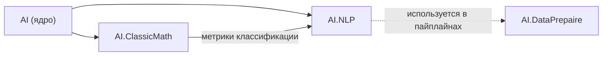

# Обработка естественного языка (AI.NLP)

Сборка **`AI.NLP`** (`AI.NLP.dll`, **.NET 9.0**) содержит лёгкие текстовые и статистические средства: стемминг русского языка, частотные и «вероятностные» словари, мешок слов (BoW), TF‑IDF, простую извлекательную суммаризацию, токенизатор и вспомогательные утилиты строк. Зависимости: **`AI`** (векторы `AI.DataStructs.Algebraic`, расширения `AI.Extensions`, статистика `AI.Statistics` там, где используется) и **`AI.ClassicMath`** — ради метрик классификации (`MetricsForClassification`), которыми измеряется разметка частей речи.

Полноценные пайплайны подготовки данных и токенизаторы уровня продакшена развиваются в **`AI.DataPrepaire`**; **`AI.NLP`** ориентирован на учебные сценарии и общие примитивы, которые подключаются из **`AI.DataPrepaire`**, прикладных модулей (**`AI.Fuzzy`**, **`AI.ONNX`** и др.) и тестов.

---

## Пространства имён

| Пространство имён | Назначение |
|-------------------|------------|
| `AI.NLP` | Словари вероятностей, TF‑IDF, BoW, `TextTokenizer`, `TextStandard`, суммаризация, расширения строк. |
| `AI.NLP.Stemmers` | Русский стеммер `StemmerRus`, вспомогательный класс окончаний `WordEndingsRU`. |
| `AI.NLP.Lemmatization` | Лемматизаторы: правила русского языка, словарный, кэширующий, тождественный. |
| `AI.NLP.Morphology` | Части речи, словарь закрытых классов, определитель части речи, правила склонения. |
| `AI.NLP.Evaluation` | Эталонный корпус лемм и измерение качества разбора. |

---

## Зависимости и связи

На схеме **A → B**: **A входит в B** (у **B** есть `ProjectReference` на **A**).



- **`AI.NLP`** подключает **`AI`** и **`AI.ClassicMath`**; **`AI.DataPrepaire`** подключает **`AI.NLP`** там, где нужны токенизация и текстовые словари (например `TextStandard`, `ProbabilityDictionaryHash`).
- Другие сборки и тесты могут отдельно ссылаться на **`AI.NLP`** рядом с fuzzy/ML — см. `*.csproj` конкретного проекта.

---

## Основные типы (по файлам)

| Файл в `src/AI.NLP/` | Класс / тип | Роль |
|----------------------|-------------|------|
| `ProbabilityDictionary.cs` | `ProbabilityDictionary` | Частоты токенов; «вероятность» = доля вхождений относительно числа фрагментов после разбиения текста. |
| `ProbabilityDictionaryData.cs` | `ProbabilityDictionaryData<T>` | Пара «слово / вероятность». |
| `ProbDictHash.cs` | `ProbabilityDictionaryHash` | Нормированные частоты в `Dictionary<string, double>` на основе `GetWords`. |
| `TFIDF.cs` | `TFIDF` | TF по документу, IDF по корпусу, скалярное усреднение по запросу, поиск документа. |
| `TFIDFDictionary.cs` | `TFIDFDictionary` | Корпус из файлов каталога, векторы слов, сходство через корреляцию. |
| `BoWModel.cs` | `BoWModel` | Мешок слов по фиксированному словарю из файла. |
| `TextTokenizer.cs` | `TextTokenizer` | Словарь индексов по обучающему тексту, векторы токенов. |
| `TextStandard.cs` | `TextStandard` | Нормализация, фильтрация символов, Dice‑сходство множеств. |
| `TextSummarization.cs` | `TextSummarization`, `DataSummText` | Разбиение на предложения, веса, выбор топ‑предложений. |
| `StringExtention.cs` | `StringExtention` | Расширения для `string` / `string[]`. |
| `Stemmers/Stemmer.cs` | `StemmerRus` | Стемминг русских слов (алгоритм Портера, адаптация). |
| `Stemmers/WordEndingsRU.cs` | `WordEndingsRU` | Окончания как разность слова и стема. |
| `Lemmatization/RussianLemmatizer.cs` | `RussianLemmatizer` | Правила по суффиксу для глагола, прилагательного и причастия. |
| `Lemmatization/MorphologicalLemmatizer.cs` | `MorphologicalLemmatizer` | Разбор с определением части речи; склонение существительных. |
| `Morphology/RussianPosTagger.cs` | `RussianPosTagger` | Определитель части речи. |
| `Morphology/RussianNounInflection.cs` | `RussianNounInflection` | Приведение существительного к именительному падежу. |
| `Morphology/RussianClosedClassLexicon.cs` | `RussianClosedClassLexicon` | Полное перечисление закрытых классов. |
| `Evaluation/LemmaCorpus.cs` | `LemmaCorpus` | Эталонный корпус лемм (247 форм). |
| `Evaluation/LemmatizerEvaluation.cs` | `LemmatizationReport` | Измерение качества лемматизации. |
| `Evaluation/PosTaggerEvaluation.cs` | `PosTaggingReport` | Измерение качества разметки частей речи. |

---

## TF‑IDF в коде

Для термина $t$ и документа с индексом $d$:

- **TF** в документе — значение из нормированного частотного словаря `ProbabilityDictionaryHash` (сумма по токенам документа = 1 при непустом наборе токенов).
- **IDF** (реализация в `TFIDF.IDFWord`):

$$\text{idf}(t) = \log_{10}\left(0.1 + \frac{D}{df(t) + 0.001}\right)$$

где $D$ — число документов, $df(t)$ — число документов, в которых встречается термин $t$.

- **Запрос** (`TF_IDF_Str`): среднее TF‑IDF по токенам запроса (стемминг включён через `ProbabilityDictionary.GetWords`).

Точное соответствие числам зависит от токенизации и стеммера; при сравнении с внешними библиотеками учитывайте эту схему.

---

## Измерение качества лемматизации

Пока качество лемматизатора не измерено, любая правка правил — изменение вслепую: одно слово
чинится, другое ломается, и заметить это можно только случайно. Пространство имён
`AI.NLP.Evaluation` даёт эталонный корпус и отчёт, который сравнивает версии между собой.

### Корпус

`LemmaCorpus.Russian` — 247 пар «словоформа → лемма», собранных вручную и вшитых в сборку
(`Evaluation/Data/lemmas-ru.tsv`). Формат: словоформа, лемма, часть речи, раздел — через табуляцию.

Леммы записаны по соглашениям Universal Dependencies: у существительного — именительный падеж
единственного числа, у прилагательного — мужской род, у глагола — инфинитив, причём причастия
и деепричастия отнесены к глаголу, от которого образованы.

Корпус разделён на три части, и это разделение — главное в нём:

| Раздел | Записей | Что проверяет |
|--------|---------|---------------|
| `base` | 208 | Регулярные формы: то, что правила по суффиксу обязаны разбирать. |
| `suppletive` | 31 | «людей» → «человек», «шёл» → «идти»: правилами не берутся принципиально, нужен словарь. |
| `ambiguous` | 8 | «стали», «печь», «мой»: без контекста единственного ответа нет. |

Омонимичные формы в общую точность **не входят**. Требовать от лемматизатора без разметки
однозначного разбора «печь» нечестно, а включение таких форм в метрику превратило бы её
в лотерею. Они хранятся в корпусе как явно зафиксированное ограничение метода.

Имя файла — `lemmas-ru.tsv`, а не `lemmas.ru.tsv`: точку перед языковым кодом MSBuild понимает
как культуру и выносит ресурс в сателлитную сборку `ru/AI.NLP.resources.dll`, где основной
сборке он уже не виден. В `.csproj` на всякий случай стоит и `WithCulture="false"`.

### Отчёт

```csharp
LemmatizationReport report = LemmatizerEvaluation.Evaluate(new RussianLemmatizer());

Console.WriteLine(report.Accuracy);                          // доля верных ответов
Console.WriteLine(report.AccuracyFor("NOUN"));               // точность по части речи
Console.WriteLine(report.AccuracyFor(CorpusSection.Base));   // точность по разделу
Console.WriteLine(report.Interpret().ToLlmText());           // разбор с выводами
```

`LemmatizationReport` реализует `IInterpretable`: кроме чисел он объясняет, что они значат, —
называет части речи, не разобранные ни разу, и отделяет отказы (слово вернулось неизменным)
от порчи (слово превратилось в несуществующее). Отказ безопаснее: слово остаётся узнаваемым
и совпадает само с собой в другом месте текста.

`LemmatizerEvaluation.Compare(first, second)` даёт разность точностей и список форм,
разобранных по-разному, — этим удобно смотреть, что именно изменила правка правил.

### Измеренное качество

Замер от 2026-09-04, 239 форм без учёта омонимии:

| Показатель | `RussianLemmatizer` | `MorphologicalLemmatizer` |
|------------|--------------------:|--------------------------:|
| Общая точность | 61.1 % (146) | **82.8 %** (198) |
| Регулярные формы | 55.3 % | 80.3 % |
| Супплетивные формы | 100 % | 100 % |
| Существительные | 4.4 % (4 из 91) | **61.5 %** (56 из 91) |
| Прилагательные | 97.4 % | 97.4 % |
| Глаголы | 92.1 % | 92.1 % |
| Местоимения, числительные, служебные | 100 % | 100 % |
| Доля отказов среди ошибок | 95.7 % | 19.0 % |

Первый замер (до появления морфологии) показал то, чего не видно в коде:
правил склонения существительных в `RussianLemmatizer` не было вовсе — 0 из 91.
Глагол и прилагательное при этом разбирались почти безупречно, так что средняя
точность в 56 % означала не «правила слабоваты», а «одной части речи для
лемматизатора не существует». Часть слов вдобавок портилась: «конём» → «конать»
(глагольное правило `-ем`), «систему» → «систий» (адъективное `-ему`),
«поэтому» → «поэтый». Все три ошибки — от применения правила без знания части речи.

Последняя строка таблицы — цена, заплаченная за прибавку. Раньше ошибка почти всегда
была отказом (слово возвращалось нетронутым и оставалось узнаваемым), теперь чаще
портит слово: «книгой» → «книг». Это следствие соглашения, описанного ниже, и об этом
честнее знать заранее, чем обнаружить в выдаче поиска.

Пороги в `LemmatizerEvaluationTests` и `MorphologyTests` закреплены по этим замерам.
Числа корпуса в две сотни примеров годятся для сравнения версий между собой, но не
для сравнения с публикациями на больших корпусах: доверительный интервал здесь —
несколько процентов. Правила склонения писались, когда корпус уже существовал,
поэтому оценка по нему оптимистична; непредвзятая оценка требует нового корпуса.

---

## Морфологический разбор

`AI.NLP.Morphology` отвечает на вопрос «какая это часть речи» — и уже от ответа
зависит, какие правила применять.

### Что из чего состоит

| Тип | Роль |
|-----|------|
| `PartOfSpeech`, `PartOfSpeechCodes` | Часть речи и её код разметки (`NOUN`, `VERB`, …), совместимый с Universal Dependencies. |
| `RussianPhonetics` | Гласные, шипящие и заднеязычные, нормализация записи, проверка конца слова на произносимость. |
| `RussianClosedClassLexicon` | Полное перечисление закрытых классов: местоимения, числительные, предлоги, союзы, частицы, частотные наречия, неправильные глаголы. |
| `IPosTagger`, `RussianPosTagger` | Определение части речи: словарь для закрытых классов, суффиксы для открытых. |
| `RussianNounInflection` | Приведение существительного к именительному падежу. |
| `MorphologicalLemmatizer` | Лемматизатор, который сначала определяет часть речи, потом применяет её правила. |

Словарь закрытых классов — один на модуль: его читают и определитель части речи,
и `RussianLemmatizer`. Две таблицы означали бы, что однажды поправят одну, и одно
и то же слово станет разбираться по-разному в соседних вызовах — без единой ошибки сборки.

### Разметка частей речи: 96.2 %

Замер `RussianPosTagger` на том же корпусе (третий столбец `lemmas-ru.tsv` — часть речи):

| Показатель | Значение |
|------------|----------|
| Точность | **96.2 %** (230 из 239) |
| F-мера (macro) | 0.975 |
| Существительные | полнота 94.5 %, точность 96.6 % |
| Глаголы | полнота 95.2 %, точность 96.8 % |
| Прилагательные | полнота 97.4 %, точность 94.9 % |
| Закрытые классы | 100 % |

Точность, полнота и матрица ошибок считаются `MetricsForClassification`
из `AI.ClassicMath`: разметка части речи — обычная задача классификации,
и заводить для неё отдельную арифметику незачем.

Все девять оставшихся ошибок — не недоработка правил, а слова, часть речи которых
без соседей не определяется: «днём» (наречие или существительное), «дела»
(существительное или глагол), «читая» (деепричастие или прилагательное),
«красивой» (прилагательное или существительное в творительном падеже).
Снять такую омонимию можно только по контексту, а для этого нужен корпус
размеченных предложений, которого здесь нет.

### Как выбирается прочтение спорного окончания

Там, где суффикс принадлежит двум частям речи сразу, выбор сделан **по цене ошибки**,
а не по частоте. Приняв существительное за глагол, разбор превращает «кредит»
в «кредить» — несуществующее слово, которое ни с чем в тексте не совпадёт. Приняв
глагол за существительное, он чаще всего возвращает слово нетронутым. Поэтому спорные
«-ом», «-ем», «-ой», «-ет» отнесены к существительному, а глагол опознаётся по более
длинному суффиксу с тематической гласной («-ает», «-ует», «-аем»), который выигрывает
по длине: «читаем» — глагол, «конём» — существительное.

### Соглашение о лемме существительного

По одной словоформе род не виден: «столам» и «книгам» устроены одинаково. Правило
выбирает нулевое окончание («книгой» → «книг»), и это осознанная потеря женского рода
ради двух свойств:

- все формы слова сходятся к одному ключу — то, что нужно поиску и индексации;
- разбор устойчив: `Lemmatize(Lemmatize(x)) == Lemmatize(x)`. Обратное соглашение
  («книгой» → «книга») эту устойчивость ломает, потому что «книга» само разбиралось бы
  дальше. По той же причине правила применяются до неподвижной точки: основа «систем»
  сама оканчивается на «-ем».

Два места, где правило не гадает, а знает грамматику:

- **беглая гласная**: «дня» → «день», а не «днь» — потому что «дн» словом быть не может;
- **запрет на конец слова вида «шумный + м/н»**: «окном» → «окно», а не «окн», по той же
  причине, по которой родительный падеж множественного числа — «окон», а не «окн».

Что правилами не берётся принципиально и требует словаря: род существительного
в неоднозначных падежах, супплетивные формы сверх короткого списка исключений,
беглые гласные в родительном множественного («окон» → «окно»), омонимия любого рода.

### Пример

```csharp
var lemmatizer = new MorphologicalLemmatizer();

lemmatizer.Lemmatize("городами");            // город
lemmatizer.Analyze("городами").PartOfSpeech; // Noun
lemmatizer.LemmatizeSentence("Я читал книги в городах."); // я читать книг в город.

RussianPosTagger.Instance.Tag("читаем");      // Verb
RussianPosTagger.Instance.Tag("конём");       // Noun
```

---

## Сборка

```bash
dotnet build src/AI.NLP/AI.NLP.csproj -c Release
```

Метаданные NuGet для библиотек под `src/` задаются в корневом **`Directory.Build.props`**.

---

## Учебные материалы и примеры

- Теория и вызовы API по файлам: [../Tutorials/NLP/README.md](../Tutorials/NLP/README.md).
- Консольные примеры: проект **`Tests/NLP/NlpExamples`**.

---

## Лицензия

Лицензия репозитория: **Apache 2.0**. Стеммер русского языка основан на сторонней реализации с лицензией MIT; см. [../INFO.md](../INFO.md).
