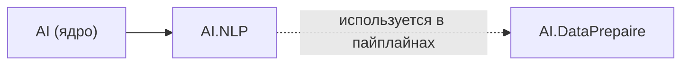

# Обработка естественного языка (AI.NLP)

Сборка **`AI.NLP`** (`AI.NLP.dll`, **.NET Standard 2.0**) содержит лёгкие текстовые и статистические средства: стемминг русского языка, частотные и «вероятностные» словари, мешок слов (BoW), TF‑IDF, простую извлекательную суммаризацию, токенизатор и вспомогательные утилиты строк. Зависимость: только **`AI`** (векторы `AI.DataStructs.Algebraic`, расширения `AI.Extensions`, статистика `AI.Statistics` там, где используется).

Полноценные пайплайны подготовки данных и токенизаторы уровня продакшена развиваются в **`AI.DataPrepaire`**; **`AI.NLP`** ориентирован на учебные сценарии и общие примитивы, которые подключаются из **`AI.DataPrepaire`**, прикладных модулей (**`AI.Fuzzy`**, **`AI.ONNX`** и др.) и тестов.

---

## Пространства имён

| Пространство имён | Назначение |
|-------------------|------------|
| `AI.NLP` | Словари вероятностей, TF‑IDF, BoW, `TextTokenizer`, `TextStandard`, суммаризация, расширения строк. |
| `AI.NLP.Stemmers` | Русский стеммер `StemmerRus`, вспомогательный класс окончаний `WordEndingsRU`. |

---

## Зависимости и связи

На схеме **A → B**: **A входит в B** (у **B** есть `ProjectReference` на **A**).



- **`AI.NLP`** подключает **`AI`**; **`AI.DataPrepaire`** подключает **`AI.NLP`** там, где нужны токенизация и текстовые словари (например `TextStandard`, `ProbabilityDictionaryHash`).
- Другие сборки и тесты могут отдельно ссылаться на **`AI.NLP`** рядом с fuzzy/ML — см. `*.csproj` конкретного проекта.

---

## Основные типы (по файлам)

| Файл в `src/AI.NLP/` | Класс / тип | Роль |
|----------------------|-------------|------|
| `ProbabilityDictionary.cs` | `ProbabilityDictionary` | Частоты токенов; «вероятность» = доля вхождений относительно числа фрагментов после разбиения текста. |
| `ProbabilityDictionaryData.cs` | `ProbabilityDictionaryData<T>` | Пара «слово / вероятность». |
| `ProbDictHash.cs` | `ProbabilityDictionaryHash` | Нормированные частоты в `Dictionary<string, double>` на основе `GetWords`. |
| `TFIDF.cs` | `TFIDF` | TF по документу, IDF по корпусу, скалярное усреднение по запросу, поиск документа. |
| `TFIDFDictionary.cs` | `TFIDFDictionary` | Корпус из файлов каталога, векторы слов, сходство через корреляцию. |
| `BoWModel.cs` | `BoWModel` | Мешок слов по фиксированному словарю из файла. |
| `TextTokenizer.cs` | `TextTokenizer` | Словарь индексов по обучающему тексту, векторы токенов. |
| `TextStandard.cs` | `TextStandard` | Нормализация, фильтрация символов, Dice‑сходство множеств. |
| `TextSummarization.cs` | `TextSummarization`, `DataSummText` | Разбиение на предложения, веса, выбор топ‑предложений. |
| `StringExtention.cs` | `StringExtention` | Расширения для `string` / `string[]`. |
| `Stemmers/Stemmer.cs` | `StemmerRus` | Стемминг русских слов (алгоритм Портера, адаптация). |
| `Stemmers/WordEndingsRU.cs` | `WordEndingsRU` | Окончания как разность слова и стема. |

---

## TF‑IDF в коде

Для термина $t$ и документа с индексом $d$:

- **TF** в документе — значение из нормированного частотного словаря `ProbabilityDictionaryHash` (сумма по токенам документа = 1 при непустом наборе токенов).
- **IDF** (реализация в `TFIDF.IDFWord`):

$$\text{idf}(t) = \log_{10}\left(0.1 + \frac{D}{df(t) + 0.001}\right)$$

где $D$ — число документов, $df(t)$ — число документов, в которых встречается термин $t$.

- **Запрос** (`TF_IDF_Str`): среднее TF‑IDF по токенам запроса (стемминг включён через `ProbabilityDictionary.GetWords`).

Точное соответствие числам зависит от токенизации и стеммера; при сравнении с внешними библиотеками учитывайте эту схему.

---

## Сборка

```bash
dotnet build src/AI.NLP/AI.NLP.csproj -c Release
```

Метаданные NuGet для библиотек под `src/` задаются в корневом **`Directory.Build.props`**.

---

## Учебные материалы и примеры

- Теория и вызовы API по файлам: [../Tutorials/NLP/README.md](../Tutorials/NLP/README.md).
- Консольные примеры: проект **`Tests/NLP/NlpExamples`**.

---

## Лицензия

Лицензия репозитория: **Apache 2.0**. Стеммер русского языка основан на сторонней реализации с лицензией MIT; см. [../INFO.md](../INFO.md).
