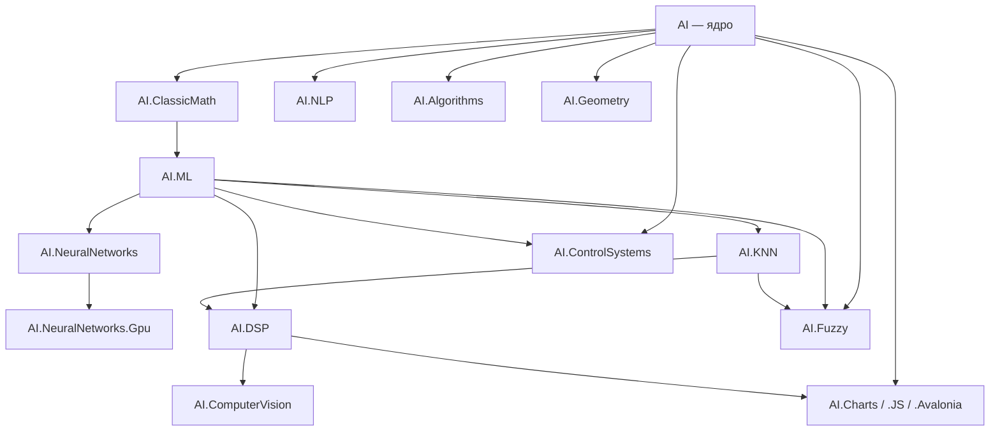

# Архитектура решения AIFramework 3 Open

Здесь собраны **обзорные** описания крупных модулей (сборок под `src/`): назначение, зависимости, основные пространства имён и ссылки на туториалы. Детальная теория и пошаговые примеры — в **[../Tutorials/](../Tutorials/)**.

## Указатель документов

| Область | Файл |
|---------|------|
| Базовое ядро **`AI`**: векторы, матрицы, статистика, расширения | [AI-Core.md](AI-Core.md) |
| Машинное обучение: **`AI.ML`**, **`AI.ClassicMath`**, смежные сборки | [MachineLearning.md](MachineLearning.md) |
| Нейронные сети: **`AI.NeuralNetworks`**, **`AI.NeuralNetworks.Gpu`** | [NeuralNetworks.md](NeuralNetworks.md) |
| Алгоритмы на графах: **`AI.Algorithms`** (потоки, MAPF, VRP/TSP) | [Algorithms.md](Algorithms.md) |
| Геометрия: **`AI.Geometry`** (преобразования, кривые, LinAlg) | [Geometry.md](Geometry.md) |
| Компьютерное зрение: **`AI.ComputerVision`** (фильтры, 2D FFT, HOG) | [ComputerVision.md](ComputerVision.md) |
| Цифровая обработка сигналов **`AI.DSP`** | [DSP.md](DSP.md) |
| Системы управления **`AI.ControlSystems`** | [ControlSystems.md](ControlSystems.md) |
| Нечёткая логика **`AI.Fuzzy`** | [FuzzyLogic.md](FuzzyLogic.md) |
| NLP **`AI.NLP`** | [NLP.md](NLP.md) |
| Графики: **`AI.Charts`**, `.JS`, `.WinForms`, `.Avalonia` | [Charts.md](Charts.md) |
| Вспомогательные модули (ONNX, DataPrepaire, KNN, Faiss, …) | [SupportingModules.md](SupportingModules.md) |

---

## Схема зависимостей (упрощённо)

Ниже не все проекты решения, а **типичный стек** от ядра к прикладным слоям. **A → B** на схеме: **A входит в B** (у **B** есть `ProjectReference` на **A**).

- **`AI.Fuzzy`** подключает **`AI`**, **`AI.ML`** и **`AI.KNN`** (нечёткая логика и гибридные компоненты в одной сборке).
- **`AI.Charts`** (net9.0) тянет **`AI`** и **`AI.DSP`** (окна Фурье, статистика сигналов).
- **`AI.ControlSystems`** опирается на **`AI`**, **`AI.ML`** и классическую математику через цепочку **`AI.ML` → AI.ClassicMath → AI**.
- **`AI.NeuralNetworks.Gpu`** — GPU-ускорение V2 Tensor Engine через ILGPU/CUDA.
- **`AI.ComputerVision`** использует **`AI.DSP`** для 1D FFT (в основе 2D FFT).

Корневые файлы решения: **`AIFramework.sln`**, **`AIFramework-Core.sln`**, а также узкие подборки в каталоге **`SLNS/`**.

---

## Стандарт кода

Единые правила для всех 23 библиотек описаны в **[../../CODING_STANDARD.md](../../CODING_STANDARD.md)**: форматирование, именование, публичный API (`Vector`/`Matrix`/`NDTensor`), интерфейсы (`IAlgorithm`, `IEstimator`, `ITransformer`), XML-документация.

---

## Сборка документации локально

Документы в формате Markdown; предпросмотр — в IDE или через `dotnet`/`docfx`, если настроено в репозитории.

Общая лицензия и благодарности сторонним проектам: **[../INFO.md](../INFO.md)**.
