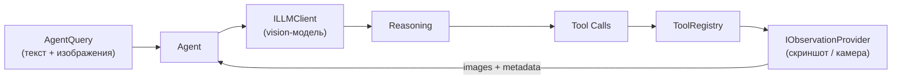

# Мультимодальный ReAct-агент (Observe-Reason-Act)

AIFramework поддерживает мультимодальный цикл **Observe-Reason-Act** — агент
не только обрабатывает текст, но и **видит** через подключённые источники
изображений (камера, скриншот, датчики).

## Архитектура

```
User query + images --> Agent --> LLM (vision) --> Tool calls --> Observe --> LLM --> ...
```



## Ключевые абстракции

| Класс | Назначение |
|---|---|
| `AgentImage` | Обёртка над `byte[]` + MIME + label |
| `AgentQuery` | Текст + изображения для запроса к агенту |
| `AgentObservation` | Результат наблюдения (изображения + метаданные) |
| `IObservationProvider` | Интерфейс поставщика наблюдений |
| `ToolResult` | Мультимодальный результат инструмента (текст + изображения) |

Все типы расположены в `AI.LLM.Agents.Multimodal`.

## Быстрый старт

```csharp
var agent = AgentBuilder.Create()
    .WithLLM(llm)
    .WithSystemPrompt("Ты мультимодальный ассистент с Vision.")
    .WithTools(new MyTools())
    .WithObserver(new ScreenshotProvider())   // <- IObservationProvider
    .WithMaxIterations(10)
    .Build();

// Текст + изображение
var query = new AgentQuery(
    "Что на экране? Нажми кнопку OK.",
    new AgentImage(screenshotBytes, "image/png", "desktop"));

var result = await agent.RunAsync(query);
```

## IObservationProvider

Реализуйте `IObservationProvider` для своего источника данных:

### Скриншот рабочего стола (Computer Use)

```csharp
public class ScreenshotProvider : IObservationProvider
{
    public async Task<AgentObservation> ObserveAsync(CancellationToken ct)
    {
        // Захват экрана (platform-specific)
        var bitmap = CaptureDesktop();
        var png = EncodePng(bitmap);

        return new AgentObservation(
            new AgentImage(png, "image/png", "desktop_screenshot"),
            $"Скриншот {DateTime.Now:HH:mm:ss}, {bitmap.Width}×{bitmap.Height}");
    }
}
```

### Камера робота

```csharp
public class RobotCameraProvider : IObservationProvider
{
    private readonly ICamera _camera;
    private readonly IRobotState _robot;

    public async Task<AgentObservation> ObserveAsync(CancellationToken ct)
    {
        var frame = await _camera.CaptureFrameAsync(ct);

        return new AgentObservation(
            new AgentImage(frame.JpegBytes, "image/jpeg", "camera_front"),
            $"Позиция ({_robot.X:F1}, {_robot.Y:F1}), угол {_robot.Heading:F0}°");
    }
}
```

### Множественные камеры / датчики

```csharp
public class MultiSensorProvider : IObservationProvider
{
    public async Task<AgentObservation> ObserveAsync(CancellationToken ct)
    {
        var rgb = await _rgbCamera.CaptureAsync(ct);
        var depth = await _depthSensor.CaptureAsync(ct);

        return new AgentObservation(
            [
                new AgentImage(rgb, "image/jpeg", "rgb_front"),
                new AgentImage(depth, "image/png", "depth_map")
            ],
            "RGB + карта глубины");
    }
}
```

## Инструменты с изображениями

Инструменты могут возвращать `ToolResult` вместо `string` для передачи
изображений в визуальный контекст агента:

```csharp
[AgentTool("capture_camera", "Захватывает кадр с камеры")]
public ToolResult CaptureCamera()
{
    var frame = _camera.Capture();
    return new ToolResult(
        "Кадр захвачен",
        new AgentImage(frame, "image/jpeg", "camera"));
}

[AgentTool("analyze_region", "Анализирует область изображения")]
public ToolResult AnalyzeRegion(int x, int y, int width, int height)
{
    var crop = _screen.Crop(x, y, width, height);
    var analysis = DetectObjects(crop);
    return new ToolResult(
        $"Найдено {analysis.Count} объектов в области ({x},{y},{width},{height})",
        new AgentImage(crop.Annotated, "image/png", "annotated_crop"));
}
```

## Конфигурация

```csharp
var agent = AgentBuilder.Create()
    .WithLLM(llm)
    .WithObserver(myObserver)
    .WithObserveAfterTools(true)       // наблюдать после каждого tool call (по умолчанию)
    .WithMaxObservationImages(2)       // до 2 изображений в наблюдении
    .Build();
```

| Параметр | Умолчание | Описание |
|---|---|---|
| `ObserveAfterToolExecution` | `true` | Запрашивать наблюдение после tool calls |
| `MaxObservationImages` | `1` | Лимит изображений из наблюдения (экономия токенов) |

## Computer Use (пример архитектуры)

```csharp
// 1. Наблюдение: скриншот рабочего стола
var observer = new ScreenshotProvider();

// 2. Инструменты: действия на рабочем столе
var tools = new DesktopActuator();  // click, type, scroll, ...

// 3. Агент
var agent = AgentBuilder.Create()
    .WithLLM(visionLLM)
    .WithSystemPrompt("Ты Computer Use агент. Ты видишь скриншот рабочего стола. " +
                       "Используй инструменты click, type, scroll для взаимодействия.")
    .WithTools(tools)
    .WithObserver(observer)
    .Build();

var result = await agent.RunAsync("Открой калькулятор и вычисли 2+2");
```

Пример `DesktopActuator`:

```csharp
public class DesktopActuator
{
    [AgentTool("click", "Кликает мышью по координатам")]
    public ToolResult Click(int x, int y, string button = "left")
    {
        // SendInput / xdotool / CGEvent
        Mouse.Click(x, y, button);
        Thread.Sleep(300); // ожидание реакции UI
        var screenshot = CaptureDesktop();
        return new ToolResult(
            $"Клик {button} ({x}, {y})",
            new AgentImage(screenshot, "image/png", "after_click"));
    }

    [AgentTool("type_text", "Вводит текст с клавиатуры")]
    public string TypeText(string text)
    {
        Keyboard.Type(text);
        return $"Введено: «{text}»";
    }

    [AgentTool("scroll", "Прокручивает страницу")]
    public string Scroll(string direction = "down", int amount = 3)
    {
        Mouse.Scroll(direction, amount);
        return $"Прокрутка {direction} на {amount}";
    }
}
```

## Робототехника (пример архитектуры)

```csharp
var observer = new RobotCameraProvider(camera, robotState);
var actuator = new RobotActuator(motorController);

var agent = AgentBuilder.Create()
    .WithLLM(visionLLM)
    .WithSystemPrompt("Ты управляешь роботом. Видишь изображение с камеры. " +
                       "Используй move, rotate, grip для выполнения задач.")
    .WithTools(actuator)
    .WithObserver(observer)
    .WithMaxObservationImages(2)  // RGB + depth
    .Build();

var result = await agent.RunAsync("Найди красный куб и поднеси его к синей зоне");
```

## AgentStep.Observation

Каждый шаг (`AgentStep`) содержит свойство `Observation` — наблюдение,
полученное на этом шаге:

```csharp
var result = await agent.RunAsync(query);

foreach (var step in result.Steps)
{
    Console.WriteLine($"Шаг {step.StepNumber}");

    if (step.Observation != null)
    {
        Console.WriteLine($"  Наблюдение: {step.Observation.Description}");
        Console.WriteLine($"  Изображений: {step.Observation.Images.Count}");
        Console.WriteLine($"  Время: {step.Observation.Timestamp}");
    }
}
```

## Что легко добавить в будущем

- **Аудио-модальность** — по тому же паттерну (`IAudioObservationProvider`)
- **ROS-интеграция** — реализация `IObservationProvider` поверх ROS topics
- **Видео-стриминг** — наблюдение с подвыборкой кадров
- **Haptic feedback** — тактильные данные через `AgentObservation.Description`
