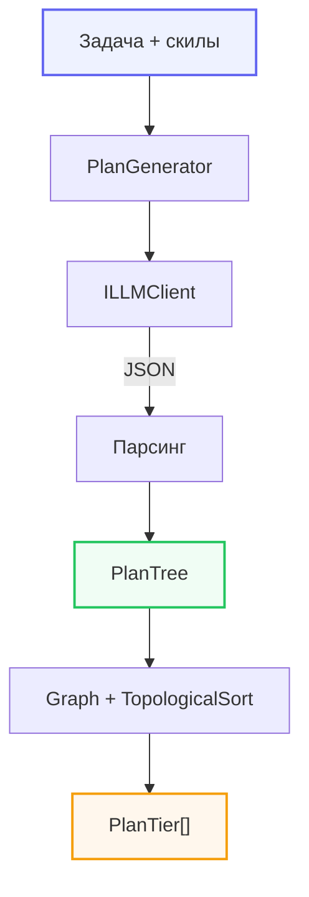
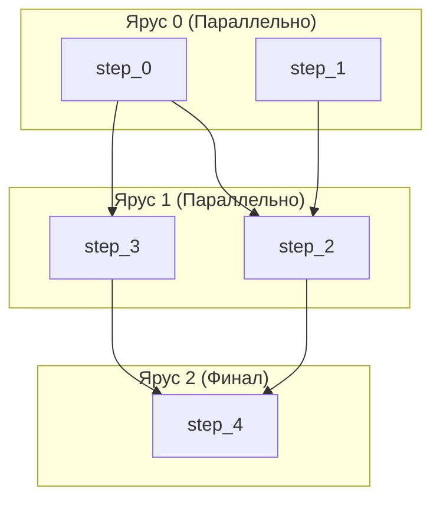

# Генератор планов на LLM

AIFramework включает `PlanGenerator` — интеллектуальную систему декомпозиции задач через LLM с автоматическим разбиением на параллельные ярусы алгоритмом Кана.

## Архитектура



**Процесс декомпозиции:**
1. **Goal**: Формулировка задачи и передача доступных инструментов/навыков.
2. **LLM**: Генерация структурированного JSON со списком шагов и зависимостей.
3. **DAG**: Построение графа и проверка на отсутствие циклов.
4. **Tiers**: Разбиение на ярусы для максимально параллельного выполнения.

## Быстрый старт

```csharp
using AI.LLM.Agents.Planning;
using AI.LLM.Clients.OpenRouter;
using AI.LLM.Services.LLM;

var llm = new LLMBase(new OpenRouterModelApi("sk-...", "openai/gpt-4.1-mini"));

var planner = PlanGeneratorBuilder.Create()
    .WithLLM(llm)
    .WithTools(new MyTools())       // инструменты [AgentTool]
    .WithMaxSteps(15)
    .Build();

var plan = await planner.GenerateAsync("Разработай REST API для магазина книг");

Console.WriteLine($"Шагов: {plan.Steps.Count}, Ярусов: {plan.Depth}");

foreach (var tier in plan.Tiers)
{
    Console.WriteLine($"--- Ярус {tier.Level} ({tier.Steps.Count} шагов, параллельно) ---");
    foreach (var step in tier.Steps)
        Console.WriteLine($"  {step.Id}: {step.Description}");
}
```

## Скилы (навыки)

Скилы — текстовые инструкции, описывающие как выполнять определённые действия.
LLM учитывает их при составлении плана.

```csharp
var planner = PlanGeneratorBuilder.Create()
    .WithLLM(llm)
    .WithSkill(new Skill("deploy_docker",
        "Для деплоя используй Docker: создай Dockerfile, " +
        "собери образ, запусти контейнер на порте 8080"))
    .WithSkill(new Skill("test_api",
        "Для тестирования API используй xUnit + HttpClient. " +
        "Тестируй CRUD-операции для каждой сущности."))
    .Build();

// Скилы также можно передать при генерации
var plan = await planner.GenerateAsync(
    "Разверни сервис обработки заказов",
    additionalSkills: [new Skill("monitoring", "Настрой Prometheus + Grafana")]);
```

## Ярусная декомпозиция (алгоритм Кана)

Шаги плана образуют DAG (направленный ациклический граф) через поле `DependsOn`.
`TopologicalSort` из `AI.Algorithms.GraphStructure` (алгоритм Кана) вычисляет
порядок выполнения, а затем шаги группируются в ярусы:

- **Ярус 0**: шаги без зависимостей (корни) — выполняются первыми, параллельно
- **Ярус 1**: шаги, зависящие только от яруса 0
- **Ярус N**: шаги, все зависимости которых выполнены на ярусах 0..N-1



Переиспользуются классы из `AI.Algorithms`:
- `AI.Algorithms.EWG.Graph` — невзвешенный граф (список смежности)
- `AI.Algorithms.GraphStructure.TopologicalSort` — алгоритм Кана

### Обнаружение циклов

Если LLM создаёт циклические зависимости, `TopologicalSort.HasCycle` = true,
и `PlanTree.HasCycle` сигнализирует о невалидном плане:

```csharp
if (plan.HasCycle)
    Console.WriteLine("План содержит циклические зависимости!");
```

## Инструменты в плане

LLM видит описания всех `[AgentTool]` и может привязать шаг к инструменту:

```csharp
public class DeployTools
{
    [AgentTool("run_tests", "Запускает тесты проекта")]
    public string RunTests([ToolParameter("Путь к проекту")] string path)
        => $"Тесты в {path} прошли: 42 passed, 0 failed";

    [AgentTool("deploy_docker", "Деплоит Docker-контейнер")]
    public string Deploy(
        [ToolParameter("Имя образа")] string image,
        [ToolParameter("Порт")] int port = 8080)
        => $"Контейнер {image} запущен на порте {port}";
}

var planner = PlanGeneratorBuilder.Create()
    .WithLLM(llm)
    .WithTools(new DeployTools())
    .Build();
```

В результирующем плане:

```csharp
foreach (var step in plan.Steps)
{
    if (step.ToolName != null)
        Console.WriteLine($"{step.Id}: вызвать {step.ToolName}({string.Join(", ", step.ToolArguments)})");
    else
        Console.WriteLine($"{step.Id}: ручной шаг — {step.Description}");
}
```

## Выполнение плана агентом

`PlanTree` можно использовать для управления `Agent` — выполнять шаги по ярусам:

```csharp
foreach (var tier in plan.Tiers)
{
    // Шаги яруса выполняются параллельно
    var tasks = tier.Steps
        .Where(s => s.ToolName != null)
        .Select(s => agent.RunAsync($"Выполни: {s.Description}"));

    await Task.WhenAll(tasks);
}
```

## Визуализация плана

`PlanTreeVisualizer` предоставляет несколько форматов визуализации:

### SVG (для HTML/Blazor)

```csharp
string svg = PlanTreeVisualizer.ToSvg(plan);
// Вставляется как MarkupString в Blazor или innerHTML в HTML
```

Генерирует inline SVG с узлами (скруглённые прямоугольники), стрелками зависимостей
и ярусными метками. Узлы, привязанные к инструментам, выделены цветом.

### Mermaid

```csharp
string mermaid = PlanTreeVisualizer.ToMermaid(plan);
// flowchart TD с subgraph для каждого яруса
```

### Текстовое дерево

```csharp
string text = PlanTreeVisualizer.ToText(plan);
```

Компактное ASCII-представление ярусов:
```text
Plan: Разработай REST API
Steps: 5, Tiers: 3

┌─── Tier 0 (2 parallel) ───
│  step_0: Определить модели данных
│  step_1: Настроить проект
└────────────────────────────────
┌─── Tier 1 (2 parallel) ───
│  step_2: Реализовать CRUD [run_tests] ← step_0, step_1
│  step_3: Написать тесты ← step_0
└────────────────────────────────
┌─── Tier 2 (1 parallel) ───
│  step_4: Деплой [deploy_docker] ← step_2, step_3
└────────────────────────────────
```

### GraphData (для AI.Charts)

Для рендеринга через AI.Charts (SkiaSharp), AI.Charts.JS (Plotly),
AI.Charts.Avalonia или AI.Charts.WinForms:

```csharp
// Извлечь данные для графа
var (steps, edges) = PlanTreeVisualizer.ExtractGraphLayout(plan);

// AI.Charts (SkiaSharp/Avalonia/WinForms)
var graphData = GraphData.CreateTieredLayout(steps, edges);
var chartView = new ChartView();
chartView.ChartName = "План: " + plan.Goal;
chartView.AddGraph(graphData);

// AI.Charts.JS (Plotly)
var pb = new PlotlyBuilder { Title = "План: " + plan.Goal };
var nodes = steps.Select(s => (s.x, s.y, s.label, s.tier)).ToArray();
// ... используйте pb.AddDirectedGraph(nodes, edges)
```

## Конфигурация

| Параметр | Умолчание | Описание |
|---|---|---|
| `MaxSteps` | 20 | Максимальное число шагов |
| `Temperature` | 0.2 | Температура генерации (низкая = детерминированный план) |
| `MaxTokens` | 4096 | Лимит токенов в ответе LLM |

## PlanTree — структура результата

| Свойство | Тип | Описание |
|---|---|---|
| `Goal` | string | Исходная задача |
| `Steps` | IReadOnlyList\<PlanStep\> | Все шаги (топологический порядок) |
| `Tiers` | IReadOnlyList\<PlanTier\> | Ярусы параллелизма |
| `Depth` | int | Количество ярусов |
| `HasCycle` | bool | Обнаружен цикл в зависимостях |
| `Usage` | AgentUsage | Статистика LLM |

## PlanStep — один шаг

| Свойство | Тип | Описание |
|---|---|---|
| `Id` | string | Уникальный id (step_0, step_1, ...) |
| `Description` | string | Описание действия |
| `ToolName` | string | Инструмент [AgentTool] (null = ручной шаг) |
| `ToolArguments` | Dictionary | Аргументы для инструмента |
| `DependsOn` | List\<string\> | id шагов-предшественников |
| `Tier` | int | Номер яруса (вычисляется) |
