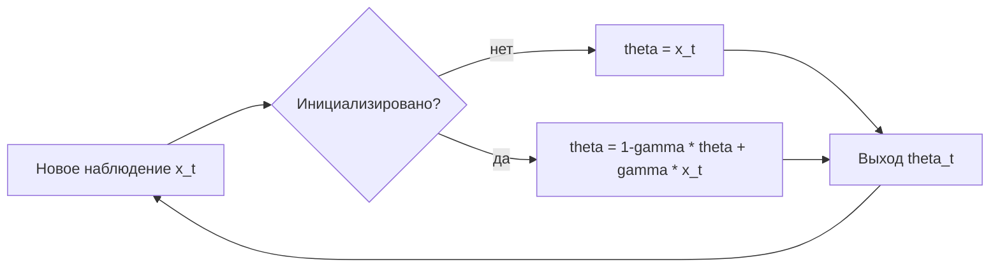

# Алгоритм C — образец документа с диаграммой

Третий файл-шаблон модуля `Template`. Показывает, как встроить схему:
блок ```` ```mermaid ```` рендерится как SVG с зумом и панорамированием,
поэтому схемы пайплайнов лучше рисовать так, а не ASCII-графикой.

## Постановка задачи

Дано: поток наблюдений $x_1, x_2, \dots$, поступающих по одному.
Требуется: поддерживать оценку $\hat{\theta}_t$ в реальном времени,
не храня всю историю.

## Теория

Рекуррентное обновление с забыванием:

$$
\hat{\theta}_t \;=\; (1 - \gamma)\,\hat{\theta}_{t-1} \;+\; \gamma\, x_t,
\qquad 0 < \gamma \le 1 .
$$

Эффективная длина окна $\approx 1/\gamma$: чем меньше $\gamma$, тем длиннее
память и тем сильнее сглаживание.



## Сложность

Время $O(1)$ на наблюдение, память $O(1)$ — независимо от длины потока.
Это главное отличие от [Алгоритма A](algo_a.md), которому нужна вся выборка.

## API

| Метод | Описание |
|-------|----------|
| `AlgorithmC(double gamma)` | Конструктор, `gamma` — коэффициент забывания |
| `Update(double x)` | Принимает наблюдение, возвращает текущую оценку |
| `Reset()` | Сброс состояния |
| `Value` | Текущая оценка без обновления |

Исходник: `src/AI.Template/AlgorithmC.cs`.

## Код

```csharp
using AI.Template;

var algo = new AlgorithmC(gamma: 0.1);

foreach (double x in stream)
{
    double theta = algo.Update(x);
    Console.WriteLine($"{x:F3} -> {theta:F3}");
}
```

## Ограничения

- Первая оценка равна первому наблюдению: на коротких потоках заметно
  смещение, вызванное инициализацией.
- При $\gamma = 1$ вырождается в «последнее значение» и не сглаживает.
- Не восстанавливает пропуски: интервалы между наблюдениями считаются
  равными.

## См. также

- [Алгоритм A](algo_a.md) — пакетная (batch) версия
- [Алгоритм B](algo_b.md) — многомерное разложение
