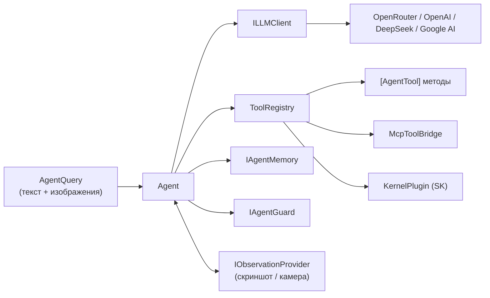
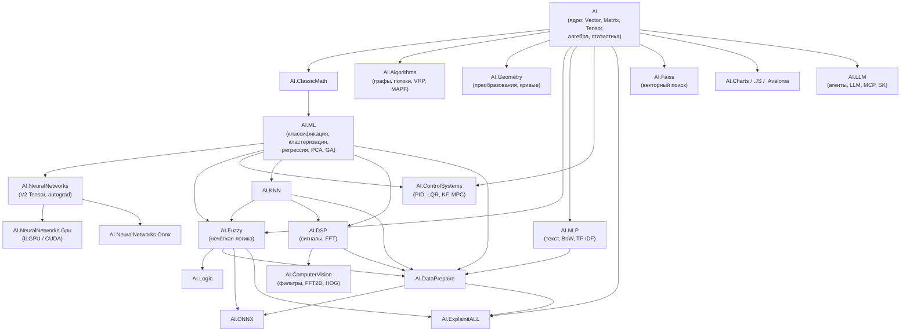

## О проекте

**AIFramework 3.0 Open** — универсальный open-source SDK на C# / .NET 10 для создания AI-агентов и интеллектуальных систем. Включает **24 библиотеки**, покрывающие весь стек: от LLM-интеграции и автономных агентов до нейросетей, DSP, NLP, компьютерного зрения и 220+ алгоритмов — с единым Blazor-демонстратором.

### Ключевые возможности

- **AI-агенты** — автономный ReAct-цикл (`AgentBuilder`), native function calling + prompt fallback для моделей без FC, память (скользящее окно, векторная, суммаризация), гарды безопасности, детальный биллинг (LLM + инструменты). Мультимодальный цикл **Observe-Reason-Act**.
- **LLM-интеграция** — OpenAI, OpenRouter, DeepSeek, Google AI Studio, Perplexity; потоковая генерация, мультимодальность, reasoning-модели, биллинг, proxy-ротация.
- **MCP-сервер** — атрибут `[AgentTool]` превращает любой метод в инструмент для Cursor, Claude Desktop и других MCP-клиентов через `McpToolBridge`.
- **Semantic Kernel** — `IChatCompletionService`-обёртка поверх `ILLMClient`, сохраняющая биллинг; инструменты как `KernelPlugin`.
- **Машинное обучение** — нейросети (MLP, RNN, CNN), классификаторы (kNN, SVM, Байес), кластеризация (K-Means, FOREL, SOM), регрессия, PCA, генетические алгоритмы.
- **Глубокое обучение (V2 Tensor Engine)** — autograd в стиле PyTorch, MLP, GRU, автоэнкодеры, GPU через ILGPU/CUDA.
- **Алгоритмы на графах** — BFS/DFS, Dijkstra, A\*, MST, максимальный поток, паросочетания, MAPF (CBS/ECBS/PBS, PIBT, LaCAM), VRP/TSP.
- **Компьютерное зрение** — 2D FFT (CPU/cuFFT GPU), Sobel, HOG, эквализация, цветовая обработка.
- **DSP** — фильтры (IIR/FIR), FFT, спектральный анализ (Уэлч), DSP-конвейеры.
- **NLP** — стеммер, лемматизация, BoW, TF-IDF, BPE/Sentence-токенизация, NER, суммаризация.
- **Геометрия** — преобразования (аффинные, гомография, кватернионы), RANSAC, Безье/Эрмит, SVD/LU/Холецкий.
- **Системы управления** — PID, LQR, LQG, KF/EKF, MPC, скользящий режим, MRAC, RLS.
- **Высокая производительность** — OpenBLAS, ILGPU/CUDA, cuFFT, `Parallel.For`.
- **Интерактивный демонстратор** — Blazor Server с LaTeX (KaTeX), Plotly-графиками и визуализацией всех модулей.

---

## Быстрый старт

```bash
git clone https://github.com/AIFramework/AIFramework3Open.git
cd AIFramework3Open
dotnet restore AIFramework.sln
dotnet build  AIFramework.sln -c Release
dotnet test   AIFramework.sln -c Release --no-build
```

**Запуск интерактивного демонстратора:**

```bash
cd Demo/WebUI/AiFrameworkDemo/AiFrameworkDemo
dotnet run -c Release
# Откройте https://localhost:5001 в браузере
```

---

## AI-агенты

Создание автономного агента с инструментами за 10 строк:

```csharp
using AI.LLM.Agents;
using AI.LLM.Agents.Tools;
using AI.LLM.Clients.OpenRouter;
using AI.LLM.Services.LLM;

var llm = new LLMBase(new OpenRouterModelApi("sk-...", "anthropic/claude-sonnet-4"));

var agent = AgentBuilder.Create()
    .WithLLM(llm)
    .WithSystemPrompt("Ты аналитик данных. Используй инструменты для вычислений.")
    .WithTools(new MyTools())
    .WithMaxIterations(5)
    .Build();

var result = await agent.RunAsync("Вычисли среднее для чисел: 2, 5, 8, 11, 14");
Console.WriteLine(result.Answer);
Console.WriteLine(result.Usage);   // токены, стоимость, время инструментов
```

Инструменты объявляются атрибутами на любом классе:

```csharp
public class MyTools
{
    [AgentTool("compute_statistics", "Описательная статистика числового ряда")]
    public string Stats([ToolParameter("Числа через запятую")] string numbers)
    {
        var values = numbers.Split(',').Select(double.Parse).ToArray();
        var v = new AI.DataStructs.Algebraic.Vector(values);
        var stat = new AI.Statistics.Statistic(v);
        return $"n={values.Length}, μ={stat.Expected:F4}, σ={stat.STD:F4}";
    }
}
```

### Архитектура агента



## MCP-сервер

Любой алгоритм фреймворка доступен внешним клиентам (Cursor, Claude Desktop) как MCP-инструмент:

```csharp
var builder = WebApplication.CreateBuilder();
builder.Services
    .AddMcpServer()
    .WithHttpTransport()
    .AddAIFrameworkTools(new MyTools(), new SignalProcessingTools());

var app = builder.Build();
app.MapMcp();
app.Run();
```

---

## Semantic Kernel

`LLMClientChatCompletionService` — мост между SK и `ILLMClient`, сохраняющий биллинг и reasoning-настройки:

```csharp
using AI.LLM.Integration.SemanticKernel.Extensions;

var kernel = Kernel.CreateBuilder()
    .AddSharpGPTChatCompletion(llm, "anthropic/claude-sonnet-4")
    .Build();

kernel.Plugins.Add(ToolRegistry.FromObjects(new MyTools()).ToKernelPlugin());
```

---

## Примеры кода

<details>
<summary><strong>AutoDiff (PyTorch-like API)</strong></summary>

```csharp
using AI.ML.NeuralNetworks.AutoDiffMath;

using var ctx = new ADContext(isBackward: true);
var a = AD.Tensor(ctx, new float[] { 1, 2, 3, 4 }, 2, 2);
var b = AD.Tensor(ctx, new float[] { 2, 0, 0, 2 }, 2, 2);

var c = a.MatMul(b) + 5.0f;
var loss = c.Sigmoid();

loss.Backward(); // Вычисляет градиенты a.Grad, b.Grad
```
</details>

<details>
<summary><strong>K-Means кластеризация</strong></summary>

```csharp
using AI.ML.Clustering;
using AI.DataStructs.Algebraic;

var data = new Vector[] { /* ... */ };
var km = new KMeans(clusterCount: 3);
km.Train(data, seed: 42);
int[] labels = km.Classify(data);
```
</details>

<details>
<summary><strong>Линейная регрессия</strong></summary>

```csharp
using AI.ML.Regression;
using AI.DataStructs.Algebraic;

var reg = new LinearRegression();
reg.Fit(xValues, yValues);
Vector predicted = reg.Predict(newX);
Console.WriteLine($"y = {reg.Lrm.Slope:F3}·x + {reg.Lrm.Intercept:F3}");
```
</details>

<details>
<summary><strong>2D FFT фильтрация изображения</strong></summary>

```csharp
using AI.ComputerVision;
using AI.DataStructs.Algebraic;

Matrix image = /* загрузка изображения как Matrix */;
var (real, imag) = FFT2D.Forward(image);
FFT2D.LowPassFilter(real, imag, cutoffRadius: 30);
Matrix filtered = FFT2D.Inverse(real, imag, image.Height, image.Width);
```
</details>

<details>
<summary><strong>PID-регулятор</strong></summary>

```csharp
using AI.ControlSystems.Pid;

var pid = new PidController(kp: 1.0, ki: 0.5, kd: 0.1, dt: 0.01);
for (int i = 0; i < 1000; i++)
{
    double error = setpoint - measurement;
    double control = pid.Update(error);
    measurement = plant.Step(control);
}
```
</details>

---

## Интерактивный демонстратор

Unified Blazor Server демонстратор объединяет все модули в одном интерфейсе с LaTeX-формулами, интерактивными графиками и runtime-переключением CPU/GPU:

| Библиотека | Демонстрируемые возможности |
|------------|---------------------------|
| **AI.LLM** | AI-агенты (ReAct), инструменты, Semantic Kernel, MCP, память |
| **AI (ядро)** | Статистика, распределения, корреляция, KL-дивергенция, Монте-Карло |
| **AI.Algorithms** | Графы (BFS/DFS, Dijkstra, A\*, MST), потоки, паросочетания, MAPF, VRP/TSP |
| **AI.ML** | Классификация, кластеризация, регрессия, PCA, GA |
| **AI.NeuralNetworks** | MLP, GRU, автоэнкодер, нейрорегрессия |
| **AI.ComputerVision** | 2D FFT, Sobel, HOG, эквализация |
| **AI.ControlSystems** | PID, LQR, KF/EKF, MPC, скользящий режим |
| **AI.DSP** | Фильтры, FFT, спектр Уэлча |
| **AI.NLP** | Стемминг, TF-IDF, токенизация, суммаризация |
| **AI.Geometry** | Преобразования, кривые, подгонка RANSAC |
| **AI.Faiss** | KNN-поиск, кластеризация |
| **AI.ONNX** | Dense, Softmax, BERT-эмбеддинги |

---

## Архитектура сборок



---

## Модули (24 библиотеки)

| Сборка | Назначение |
|--------|------------|
| **AI.LLM** | AI-агенты (ReAct, function calling, prompt fallback), LLM-клиенты (OpenAI, OpenRouter, DeepSeek, Google AI), MCP-сервер, Semantic Kernel интеграция, память, гарды, биллинг. |
| **AI** | Базовые типы (`Vector`, `Matrix`, `Tensor`, `NDTensor`), линейная алгебра, статистика. Интерфейсы `IAlgorithm`, `IEstimator`, `ITransformer`. |
| **AI.ClassicMath** | Численное интегрирование, интерполяция, ОДУ, SVD, калькулятор выражений. |
| **AI.ML** | Нейросети (MLP, RNN, CNN), классификаторы (`IClassifier`), кластеризация, регрессия, PCA, GA. OpenBLAS. |
| **AI.NeuralNetworks** | Tensor Engine V2: autograd, Module/Parameter API, линейные слои, активации. |
| **AI.NeuralNetworks.Gpu** | GPU-ускорение V2 через ILGPU: matmul, RNN/LSTM/GRU ядра. |
| **AI.NeuralNetworks.Onnx** | Маппинг V2 Tensor → ONNX Runtime. |
| **AI.KNN** | k-ближайших соседей: классификация, регрессия, мультирегрессия. |
| **AI.Fuzzy** | Нечёткая логика (Мамдани / Ларсена / Сугено / Цукамото), нечёткий PID. |
| **AI.NLP** | Стеммер, лемматизация, BoW, TF-IDF, токенизация, NER, суммаризация. |
| **AI.ControlSystems** | PID, LQR, LQG, KF, EKF, MPC, скользящий режим, MRAC, RLS, размещение полюсов. |
| **AI.DSP** | Фильтры (IIR/FIR), FFT, спектральный анализ (Уэлч). |
| **AI.ComputerVision** | 2D FFT (CPU + cuFFT GPU), Sobel, HOG, эквализация, цветовая обработка. |
| **AI.Algorithms** | Графы, сетевые потоки, паросочетания, MAPF, VRP/TSP, транспортная задача. |
| **AI.Geometry** | Аффинные, гомография, кватернионы, RANSAC, Безье/Эрмит, SVD/LU/Холецкий. |
| **AI.DataPrepaire** | Нормализаторы (ZNorm, MinMax), токенизаторы, DataTable, CSV. |
| **AI.ONNX** | Загрузка и инференс ONNX-моделей (Dense, Softmax, BERT). |
| **AI.Faiss** | Векторный поиск: KNN, пакетный поиск, L2/IP, Assign-кластеризация. |
| **AI.Charts** | SkiaSharp-графики: scatter, line, bar, polar, PSD, 3D. |
| **AI.Charts.JS** | Plotly.js для Blazor Server. |
| **AI.Charts.WinForms** | WinForms-визуализатор. |
| **AI.Charts.Avalonia** | Avalonia-визуализатор. |
| **AI.Logic** | Логические структуры (используется в `AI.Fuzzy`). |
| **AI.ExplainitALL** | Метрики интерпретируемости и RAG-инструменты. |

---

## Структура репозитория

```
AIFramework3Open/
├── src/                              # Исходный код библиотек (24 проекта)
│   ├── AI/                           # Ядро (Vector, Matrix, Tensor, IAlgorithm)
│   ├── AI.LLM/                       # AI-агенты, LLM-клиенты, MCP, SK
│   ├── AI.ML/                        # Машинное обучение
│   ├── AI.NeuralNetworks/            # Tensor Engine V2, autograd
│   ├── AI.NeuralNetworks.Gpu/        # GPU-ускорение (ILGPU/CUDA)
│   ├── AI.Algorithms/                # Графы, потоки, MAPF, VRP/TSP
│   ├── AI.Geometry/                  # Геометрия, кривые, линейная алгебра
│   ├── AI.ComputerVision/            # Обработка изображений, 2D FFT
│   ├── AI.Fuzzy/                     # Нечёткая логика
│   ├── AI.NLP/                       # Обработка текста
│   ├── AI.ControlSystems/            # Системы автоматического управления
│   ├── AI.DSP/                       # Цифровая обработка сигналов
│   ├── AI.Charts/                    # Графика (SkiaSharp)
│   ├── AI.Charts.JS/                 # Plotly.js для Blazor
│   └── ...                           # AI.KNN, AI.DataPrepaire, AI.ONNX, AI.Faiss и др.
├── Demo/
│   └── WebUI/AiFrameworkDemo/        # Unified Blazor Server демонстратор
├── Tests/                            # Консольные и демо-тесты
├── tests/
│   ├── unit/                         # xUnit автотесты (CI)
│   └── shared/                       # Общий код для тестов
├── Docs/                             # Документация
│   ├── Architecture/                 # Архитектурные описания
│   └── Tutorials/                    # Туториалы (Markdown + LaTeX)
├── CODING_STANDARD.md                # Единый стандарт кода
├── Directory.Build.props             # Общие настройки сборки
├── .editorconfig                     # Правила форматирования
├── AIFramework.sln                   # Основное решение
└── AIFramework-Core.sln              # Только ядро
```

---

## Стандарт кода

Проект следует единому [CODING_STANDARD.md](CODING_STANDARD.md):

- **Форматирование** — UTF-8, CRLF, 4 пробела, file-scoped namespaces.
- **Именование** — PascalCase для типов/членов, `_camelCase` для приватных полей, `I`-префикс для интерфейсов.
- **Публичный API** — только `Vector` / `Matrix` / `NDTensor` в сигнатурах (не `double[]` / `double[,]`).
- **Интерфейсы** — `IAlgorithm` → `IEstimator<TInput,TLabel>` (Fit/Predict), `ITransformer<TInput,TOutput>` (Fit/Transform).
- **XML-документация** — на русском языке для public/protected членов.
- **Анализаторы** — `EnforceCodeStyleInBuild`, .NET Analyzers, `.editorconfig`.

---

## Документация

| Ресурс | Содержание |
|--------|------------|
| [CODING_STANDARD.md](CODING_STANDARD.md) | Единый стандарт API и кода. |
| [CONTRIBUTING.md](CONTRIBUTING.md) | Сборка, тесты, CI, NuGet, состав модулей. |
| [Docs/Architecture/](Docs/Architecture/) | Архитектурные описания всех модулей. |
| [Docs/Tutorials/](Docs/Tutorials/) | Туториалы (Markdown + LaTeX). |
| [Docs/Tutorials/LLM/](Docs/Tutorials/LLM/) | AI-агенты, LLM, MCP, Semantic Kernel. |
| [Docs/INFO.md](Docs/INFO.md) | Контрибьюторы, атрибуция, лицензии. |

---

## Лицензия и атрибуция

Проект распространяется под **Apache 2.0**. Список контрибьюторов, сторонний код и тексты лицензий MIT для отдельных заимствований — в [Docs/INFO.md](Docs/INFO.md).
